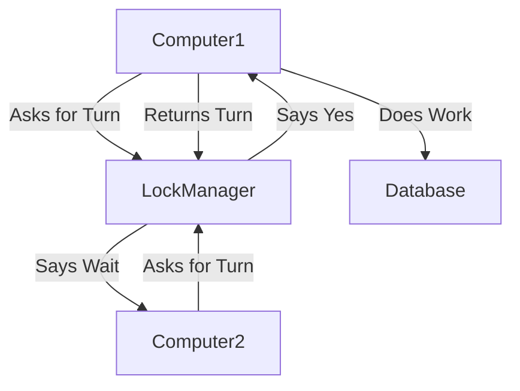

# Multi-Instance Locking: Keeping Things in Order

## Why I Built It
* When multiple computers run the same code, they often try to change the same data at the same time.
* This causes errors, duplicate work, and broken data.
* I needed a reliable way to make them take turns.

## The Problem It Solves
* It prevents two machines from running the same critical task at the exact same time.
* It stops duplicate alerts or double-billing issues.

## How It Solves It
* **The Lock**: Before a machine starts a task, it must ask for a "lock".
* **One at a Time**: Only one machine gets the lock. The others must wait or skip the task.
* **Automatic Release**: When the machine finishes, or if it crashes, the lock is given back safely.

## Architecture

