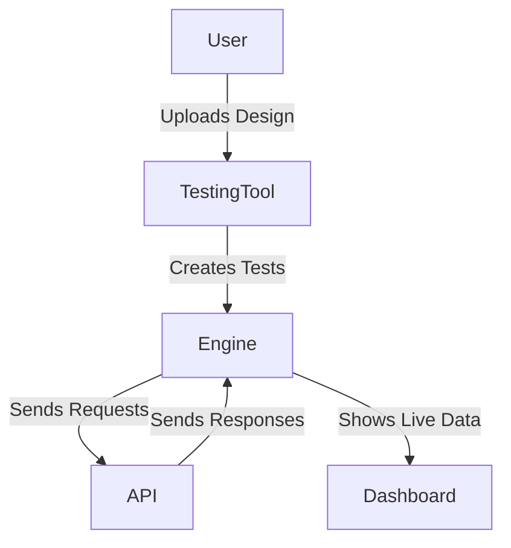

# GraphQL Meter: Making API Testing Easy

## Why I Built It
* Testing the speed and limits of APIs is often very hard.
* People spend too much time writing custom code just to run a test.
* Setting up test data and secure access is always a headache.
* Switching between different tools to see results is annoying.

## The Problem It Solves
* It stops teams from writing the same test code over and over.
* It clearly shows if an API is getting slower over time.
* It keeps everything inside one single tool.

## How It Solves It
* **Smart Setup**: It reads your API design and automatically creates the tests for you.
* **Live Views**: You can watch the speed and error numbers change in real time.
* **Side-by-Side Review**: You can look at two different tests and see what changed.
* **Ready to Go**: It runs completely on its own without complex setup steps.

## Architecture

