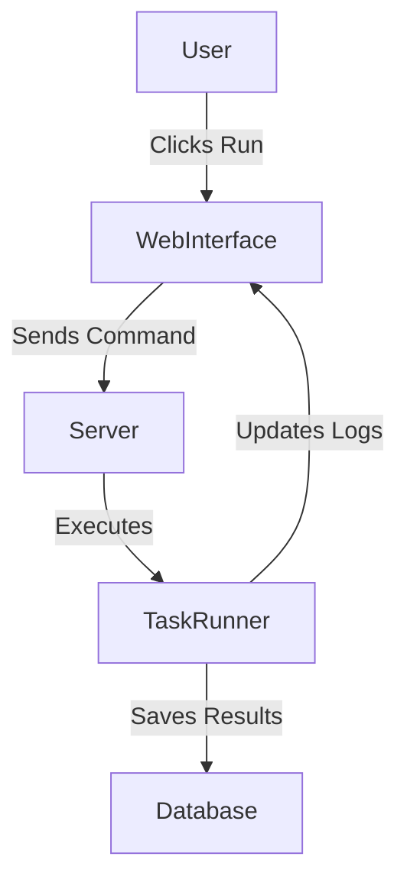

# USO: A Central Hub for Managing Scripts

## Why I Built It
* I needed an easy way to organize and run different scripts.
* Running tasks from the command line all the time was slow.
* Passing information from one script to another was a messy process.
* I wanted a way to see what was happening in real time.

## The Problem It Solves
* It takes away the need to use a terminal for everyday tasks.
* It keeps secrets and passwords safe.
* It tracks if tasks succeed or fail.

## How It Solves It
* **One Single Screen**: A simple view to see and search all available tasks.
* **Workflows**: You can link tasks together so that one runs after another.
* **Live Updates**: It shows exactly what the script is doing as it runs.
* **Schedules**: You can set tasks to run on their own at specific times.

## Architecture

